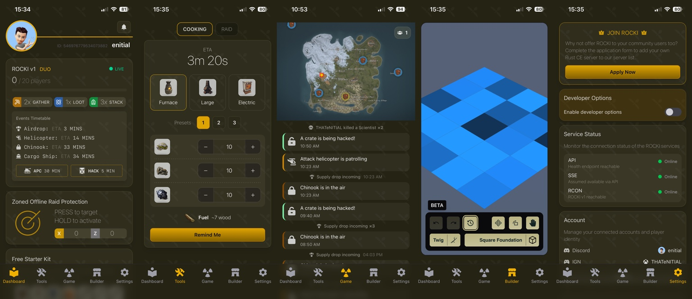
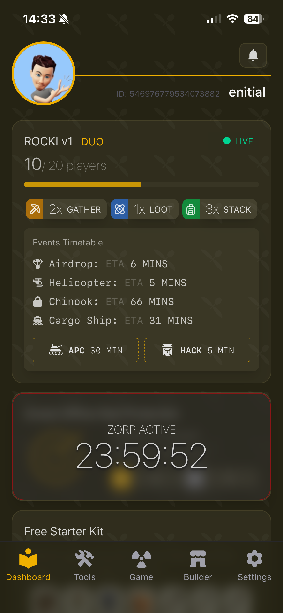
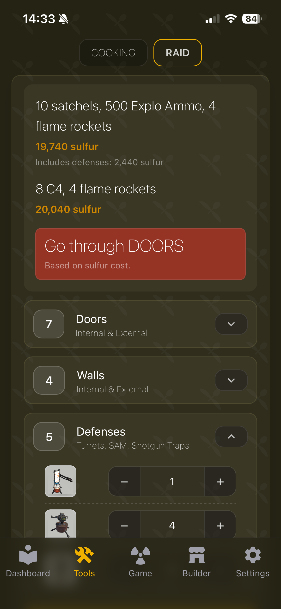
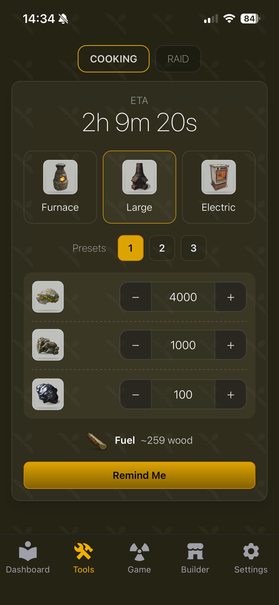
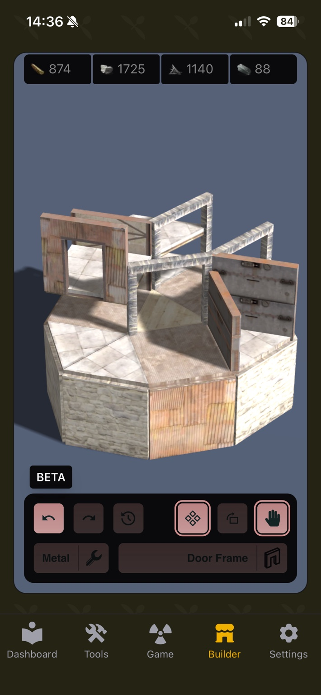
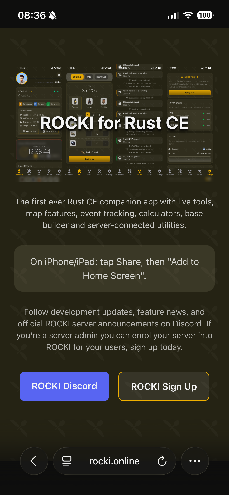

# ROCKI

  

  <strong>Rust Observation, Companion & Knowledge Interface</strong>

  The mobile-first companion platform for Rust Console Edition.

---

## Vision

ROCKI aims to become the definitive companion platform for **Rust Console Edition**, bringing live server intelligence, event tracking, calculators, mapping, base planning and community services into one focused mobile-first ecosystem.

Rust Console Edition players have historically relied on Discord servers, calculators, spreadsheets, websites and guesswork to gather information. ROCKI exists to bring those workflows into a single app.

---

## Current Status

**Private development**

ROCKI is currently in private use only and is being developed behind closed doors with selected testing groups, server owners and investment partners.

The public repository exists to document the project, show the deployed web presence and preserve the direction of the platform while the main product continues active development.

---

## The Story

ROCKI did not begin as ROCKI.

The earliest concept started life as a lightweight Discord bot for Rust Console Edition communities. The idea was simple: provide players with useful server information without forcing them to leave Discord.

As the idea grew, the project evolved into a far more ambitious platform and became known internally as **Seedy**.

What began as a bot quickly expanded into live event tracking, resource calculators, server utilities, mapping systems, base planning tools and community integrations.

As the project matured, development direction changed and community partnerships evolved. Rather than ending the project, development continued independently under a new identity.

That identity became **ROCKI**: **Rust Observation, Companion & Knowledge Interface**.

Today, ROCKI is being developed as an independent platform focused entirely on improving the Rust Console Edition experience.

---

## Why The Mascot?

ROCKI's mascot is inspired by Rust's most iconic item: **the rock**.

Every player starts with one.

> Every player starts with a rock.  
> ROCKI helps with everything that comes next.

The mascot represents accessibility, progression and community. It gives the product a friendly identity while still linking directly back to the world of Rust.

---

## Screenshots

  

---

## Features

### Live Server Dashboard

  

The dashboard gives players an immediate overview of a connected Rust Console Edition server.

It includes live population tracking, server status, gather rates, loot rates, stack multipliers, event countdowns, APC tracking, locked crate timers, starter kit access and server-specific services.

The goal is simple: put the information players normally ask for in Discord directly in front of them.

---

### Event Tracking

ROCKI tracks important server events and presents them in a clean chronological feed.

Current and planned event coverage includes Chinook, Attack Helicopter, Bradley APC, Locked Crates, Supply Drops, Oil Rig events and Cargo Ship.

The live event layer is designed around **Server-Sent Events**, keeping real-time updates lightweight and mobile friendly.

---

### Raid Calculator

  

The raid calculator helps players estimate sulfur requirements and compare raid routes.

It supports door paths, wall paths and defensive structures including turrets, SAM Sites and shotgun traps. The aim is not just to show a number, but to help players make the right decision quickly.

---

### Smelting Calculator

  

The smelting calculator estimates processing time and fuel requirements for Furnace, Large Furnace and Electric Furnace setups.

It includes presets, resource inputs, estimated completion times, wood requirements and reminder support.

---

### Base Builder

  

The base builder is an experimental mobile-first Rust CE building planner.

Current features include foundation placement, wall placement, door frames, upgrade tiers, undo, redo, pan controls and piece selection.

The long-term goal is a complete base design experience that feels natural on a phone rather than a desktop tool squeezed onto a small screen.

---

### Mapping System

The mapping system is one of ROCKI's largest planned components.

It is designed around custom markers, shared team markers, event markers, tactical overlays, team visibility, server map integration and future live teammate tracking.

The map tooling is shaped around Rust Console Edition workflows rather than generic map behaviour.

---

### ZORP

**ZORP** stands for **Zoned Offline Raid Protection**.

It is a proprietary protection system being developed as part of the ROCKI ecosystem, designed to give participating server owners configurable offline raid protection mechanics while keeping the experience simple for players.

Current development includes activation controls, countdown timers, zone management, server-side administration and future token economy integration.

---

### Service Monitoring

ROCKI includes internal diagnostics for development, testing and future server administration.

The settings area monitors API availability, SSE connectivity, RCON status, service health and account linking so issues can be identified quickly.

---

## Public Landing Page

  

The public landing page introduces ROCKI as an installable Progressive Web App and explains how players can add it to their device home screen.

---

## Repository Layout

This public repository is the deployed web presence for ROCKI.

| Path | Purpose |
| --- | --- |
| `/index.html` | Public entry point for the deployed PWA. |
| `/manifest.webmanifest` | PWA metadata, install behaviour and app icons. |
| `/sw.js` | Service worker for installable/offline-friendly behaviour. |
| `/assets/` | Built frontend JavaScript and CSS bundles. |
| `/icons/` | ROCKI app icons and favicons. |
| `/splash/` | iOS PWA splash screens. |
| `/CNAME` | GitHub Pages custom domain for `rocki.online`. |
| `/docs/images/` | README screenshots and documentation images. |

---

## Main Application Source Areas

The active ROCKI application is organised around these feature areas:

| Feature | Source Area |
| --- | --- |
| Dashboard | `apps/web/src/pages/Dashboard` |
| Tools | `apps/web/src/pages/Tools` |
| Game / Map | `apps/web/src/pages/Game` |
| Builder | `apps/web/src/pages/Builder` |
| Settings | `apps/web/src/pages/Settings` |
| API | `apps/api` |
| Database | `apps/api/prisma` |

---

## Technical Architecture

ROCKI is built as a modern Progressive Web Application.

### Frontend

- React
- Vite
- TailwindCSS
- Leaflet
- PWA install support

### Backend

- Node.js
- Express
- REST APIs
- Server-Sent Events
- RCON integration points

### Data Layer

- Prisma
- SQLite during development
- Event logs
- User/session state
- Server configuration

---

## Key Technical Decisions

### Server-Sent Events

ROCKI uses Server-Sent Events for real-time updates.

This keeps the live layer lightweight, mobile friendly and easier to operate than a heavier socket system for the current use case.

### Progressive Web App

ROCKI is designed as an installable app rather than a traditional website.

Players can add it to their home screen and use it with a native-app style experience on iPhone, iPad and Android.

### Mobile First

Most Rust Console Edition players use tools from a phone while actively playing.

ROCKI is designed touch-first, with large controls, simple cards and clear spacing instead of desktop layouts compressed into mobile screens.

---

## Beyond A Companion App

ROCKI is being designed as a platform rather than a single application.

Long-term objectives include multi-server support, team systems, shared mapping, Discord integrations, server administration tooling, economy systems, event automation, premium server services, community features and advanced analytics.

The current private builds represent the foundation of a much larger ecosystem.

---

## Roadmap

### In Development

- Team marker sharing
- Expanded event system
- Advanced mapping
- Additional calculators
- RCON integrations
- Server owner tooling

### Planned

- Multi-server support
- Team management
- Verification systems
- Economy integrations
- Community services
- Enhanced builder tools

---

## Why ROCKI Exists

Rust Console Edition deserves better tools.

The objective is not to replace gameplay.

The objective is to remove friction.

Less time searching.  
Less time calculating.  
Less time tabbing between apps.  
More time playing.

---

## Author

Created by **Bradley Ashton**.

Founder of LiteRECORDS, frontend developer and community builder.

---

  <strong>ROCKI</strong> 
  Rust Observation, Companion & Knowledge Interface

